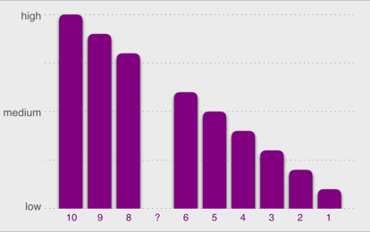
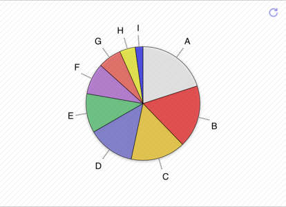

#  Graffeine

**Graffeine** /'gra•feen/ - *n* - Simple, declarative graphs for iOS.

## Introduction

It's like, graphing... with caffeine.

Graffeine is an iOS library that uses CoreAnimation to render various types of data graphs and charts. It is highly extendable and features a declarative interface, multiple layers, configuration binding, and auto-layout.

 

## Pieces and Parts

### GraffeineView

Subclass of UIView that manages and provides the rendering context for the various graphing layers, which are divided into 5 *regions*:

               Top Gutter
            +---------------+
    Left    |     Main      | Right
    Gutter  |     Region    | Gutter
            +---------------+
              Bottom Gutter

Whenever a layer exists belonging to one of the regions, its positioning and size will automatically be managed by the view, which includes responding to layout changes or resizing events.

By default, `GraffeineView` contains no layers. You must add layers to it by setting the `layers` property, like so:

    graffeineView.layers = [
            GraffeineHorizontalLabelLayer(id: "top", height: 16, region: .topGutter),
            
            GraffeineHorizontalLabelLayer(id: "bottom", height: 26, region: .bottomGutter),
            
            GraffeineBarLayer(id: "bars")
                .apply ({
                    $0.unitMargin = 5
                    $0.colors = [.blue, .orange]
                })
        ]

 

### GraffeineLayer 

*(abstract)* Container-like "graphing layer" used to represent a particular graph component. By combining layers, you can dial in exactly the layout you want and render amazing graphs.

Out of the box, there are a handful of ready-to-go graphing layers:

| GraffeineLayer                   | Displays                        |
|----------------------------------|---------------------------------|
| `GraffeineBarLayer`              |   vertical or horizontal bars   |
| `GraffeineGridLineLayer`         |   horizontal or vertical lines  |
| `GraffeineHorizontalLabelLayer`  |   labels arranged horizontally  |
| `GraffeineVerticalLabelLayer`    |   labels arranged vertically    |
| `GraffeineRadialLabelLayer`      |   labels arranged circularly    |
| `GraffeineLineLayer`             |   bezier line connecting data   |
| `GraffeinePieLayer`              |   segmented pies and donuts     |
| `GraffeinePlotLayer`             |   individual plots (points)     |

When constructing a `GraffeineLayer`, you typically provide it with an `id` and a `region`.

##### id

The id is used to identify and access the layer after it has been added to a `GraffeineView`:

    let pieLayer = graffeineView.layer(id: "pie")

##### region

You can use any layer with any region, although some are more intended for certain
regions than others. For example, the horizontal and vertical label layers are generally
intended to be placed in one of the gutter regions.

 

## Interaction

### Setting Data

`GraffeineData` is the vehicle with which to pass data into Graffeine.
It's easy to apply new data to a specific layer by **assignment**:

    graffeineView.layer(id: "pie")?.data = GraffeineData(valueMax: 100, values: [1, 1, 2, 3, 5, 8, 13, 21, 34])
                                             
Or if you want it to **animate** whenever the data changes:

    graffeineView.layer(id: "pie")?
        .setData(GraffeineData(valueMax: 100, values: [1, 1, 2, 3, 5, 8, 13, 21, 34]), 
                 animator: GraffeineDataAnimators.Pie.Spin(duration: 1.2,
                                                           timing: .easeInEaseOut))

*There are a handful of data animators included with the library, out-of-box, or you can
create your own, so long as it conforms to `GraffeineDataAnimating`.*

 

### Showing Value Labels

Out-of-the-box, there are three label options: horizontal, vertical, and radial.

##### Horizontal and Vertical Labels

Both `GraffeineHorizontalLabelLayer` and `GraffeineVerticalLabelLayer` are designed to
be used in the gutter region, where they can be configured to align with the units
displayed in the main region. This is important for things like bar and line charts,
where the labels need to line up exactly with the grid.

When using the horizontal or vertical label layers, you can choose how their unit
alignment gets distributed. Their horizontal/vertical label alignment properties
are relative to the unit, or column-width in which they are bound. So setting a label
to be `.center` means it will center itself **to the column**. Setting
`.centerLeftRight` will cause the first and last labels to be left/right aligned,
but all other labels will be centered.

##### Radial Labels

The `GraffeineRadialLabelLayer` is primarily designed to be used in conjunction with
pie and donut charts, although they do work independently. For all intents and
purposes, positioning labels in the radial label layer works just like positioning
the pie slices.

 

### Handling Selection

Selection is divided into two parts, that of receiving user interaction, and that
of rendering the selection state.

##### Receiving touch events
All selection events are raised through `GraffeineView` via the `onSelect` handler.
By assigning a handler to this, you will start receiving events whenever the user
taps on the view.

In order to receive more granular events, you first need to tell it which layer(s)
you want to receive touch events for. Do this by setting the layer's
`selection.isEnabled` property to `true`:

    graffeineView.layer(id: "bars")?.selection.isEnabled = true

This only affects whether or not the layer will respond to user touch. If enabled,
and the user's touch hits one of the items shown by that layer, then the
`onSelect` handler will include `SelectionResults` containing both the view
coordinate and the selected index.

`SelectionResult.index` should match that of the item in the values array that it
was last given. If the user tapped the view, but not on an "item", then this value
will be nil. You can interpret this as "deselection".

`SelectionResult.point` is the view coordinate of the item that was selected. This is
useful in case you wish to present some kind of pop-up UI and would like to attach
any stems or other elements to this point.

##### Rendering selection

In order to render the selection changes, you need to first enable some overrides:

    graffeineView.layer(id: "bars")?.selection.fill.color = .green
    graffeineView.layer(id: "bars")?.selection.line.color = .black
    graffeineView.layer(id: "bars")?.selection.line.thickness = 3.0

Then, just include the `selectedIndex` whenever you set the data.

For example, if you just want to immediately display selection when the user taps
on something in the graph, you can do that in the `onSelect` handler like so:

    graffeineView.onSelect = { selection in
        if let barLayer = graffeineView.layer(id: "bar") {
            var barData = barLayer.data
            barData.selectedIndex = selection.index
            barLayer.setData(barData, animator: barAnimator)
        }
    }

NOTE: Selection in Graffeine is still incomplete as it is WIP.
It works as advertised, but not all layers recognize the selection overrides,
and there are still many possible overrides yet to be included. Coming soon...

 

### Demo App

There is an iOS app,
*[graffeine-demo](https://github.com/quickthyme/graffeine-demo)*,
which demonstrates how to quickly go about composing many typical types of graphs. If
nothing else, it serves as an example of how to plug the library in and turn it on.

 
